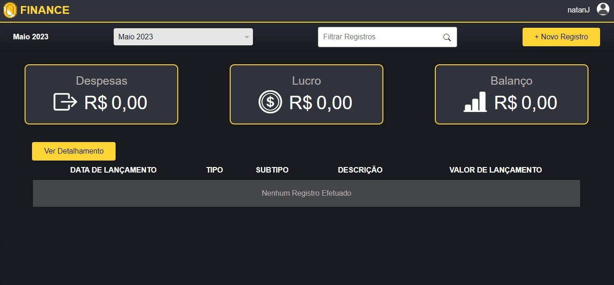
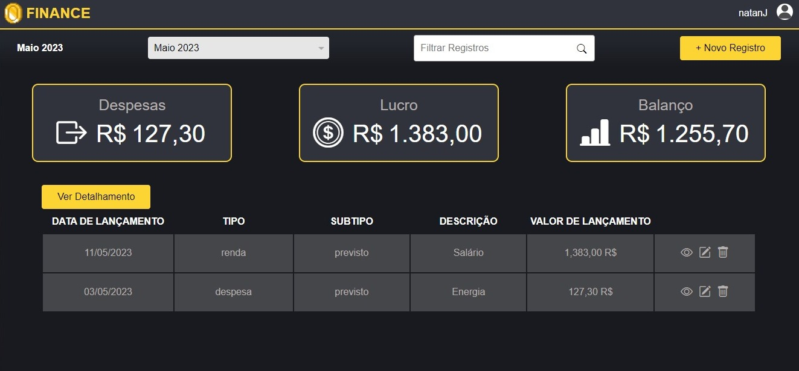
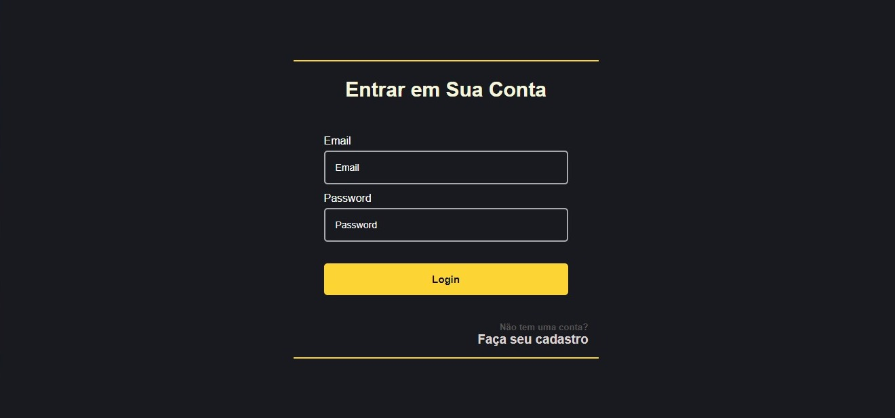
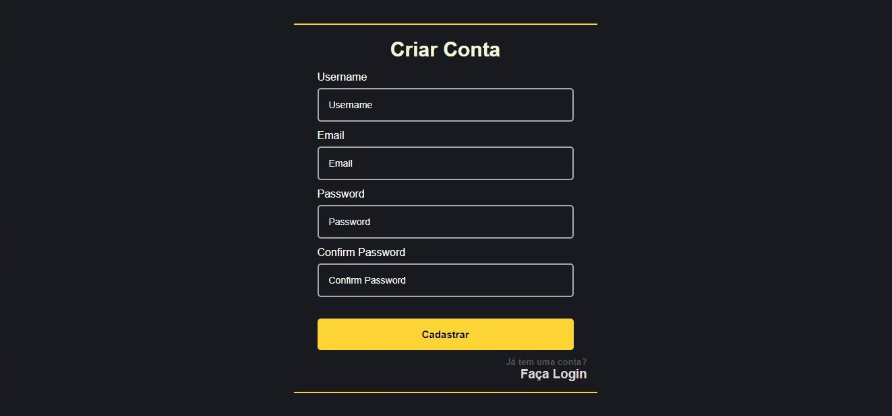
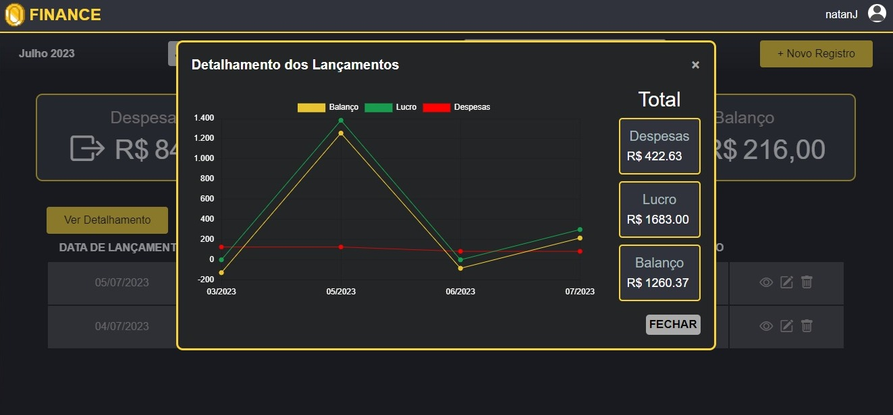

<h1 align="center">Sistema de Gestão Financeira</h1>





>Este projeto de software corresponde a um sistema de gestão de finanças que permite o controle de despesas e receitas mensais, permitindo ter um balanço de cada mês. O software conta com um sistema de cadastro de usuários e login junto a um armazenamento de dados, no qual há relatórios de lucro e despesas mensais, além de um detalhamento anual, possibilitando também novos lançamentos.

<hr>

<h1>Funcionalidades</h1>

- Cadastro de usuários
- Login de usuários
- Armazenamento em um banco de dados (MySQL, SQL ou MongoDB)
- Relatório mensal de renda e despesas
- Detalhamento Anual de rendas e despesas
- Lançamento de movimentações financeiras

<hr>

## Login de usuários
> O usuário informa o email e sua senha para ter acesso ao sistema. Será verificado se o email informado está cadastrado no banco de dados, se sim, irá verificar se a senha informada é a mesma vinculada ao email informado. Verficando os dois campos, em caso positivo, o usuário será redirecionado para a página inicial do sistema. Caso o usuário não tenha um cadastro poderá realizar um.


<hr>

## Cadastro de usuários
> O cadastro é feito através de um formulário onde é solicitado ao usuário seu username, email, senha e confirmação de senha. Em relação a senha, o usuário deverá escolher uma senha de no mínimo 6 dígitos que contenha pelo menos um caractere especial. O sistema irá verificar se o email informado já está cadastrado em nosso banco, além também de verificar se a senha digitado está conrespondente no campo de validação de senha. Em caso de alguma informação incorreta, o usuário é informado e não é permitido seu cadastro.


<hr>

## Relatório Anual
> Além das outras funções, nosso sistema conta com um relatório mensal no qual irá fornecer um gráfico de todas suas receitas e despesas lançadas naqueles meses, assim como um balanço. Com isso, o usuário poderá ter uma melhor visão de suas finanças ao longo do ano. Tendo também um Total de todas suas despesas, rendas e balanço ao lango desse ano.
 

<hr>

## Armazenamento de dados
> O cadastro de usuários e as movimentações financeiras são armazenados em um banco de dados, que pode ser MySQL, SQL ou MongoDB. A senha é salva criptografada, tornando-se assim uma string de caracteres aleatórios. O campo de confirmação de senha não é salvo no banco, apenas é usado para validar se o usuário digitou corretamente a mesma senha duas vezes.

<hr>

## Lançamentos
> O usuário pode criar um novo lançamento financeiro, informando se é do tipo despesa ou renda, seu subtipo (previsto ou extra), a data do lançamento, uma descrição breve do lançamento, descrição longa do lançamento e valor do lançamento em reais. O campo de valor é mascarado para que o usuário só precise digitar o valor e a máscara formate para a moeda brasileira.

<hr>

## Instruções para criar o banco de dados
<br>

1. Primeiro vá até a pasta de conexão com o banco, localizada em "assets/php/includes/con_db.php".
Lá você poderá editar as configurações de conexão para o seu banco. 

2. Crie um banco de dados chamado `faixa` usando o comando SQL:
    ```
    CREATE DATABASE `faixa`;
    ```

3. Crie uma tabela chamada `users` usando o seguinte comando SQL:

    ```
    CREATE TABLE `users` (
      `id` int NOT NULL AUTO_INCREMENT,
      `username` varchar(255) NOT NULL,
      `email` varchar(255) NOT NULL,
      `password` varchar(255) NOT NULL,
      PRIMARY KEY (`id`)
    ) ENGINE=InnoDB DEFAULT CHARSET=utf8mb4;
    ```

4. Crie uma tabela chamada `lancamentos` usando o seguinte comando SQL:

    ```
    CREATE TABLE `lancamentos` (
      `id` int NOT NULL AUTO_INCREMENT,
      `user_id` int NOT NULL,
      `datetime` date NOT NULL,
      `type` varchar(255) NOT NULL,
      `subtype` varchar(255) NOT NULL,
      `description` varchar(255) NOT NULL,
      `long_description` text NOT NULL,
      `valores` decimal(10,2) NOT NULL,
      PRIMARY KEY (`id`),
      KEY `fk_user_id` (`user_id`),
      CONSTRAINT `releases_ibfk_1` FOREIGN KEY (`user_id`) REFERENCES `users` (`id`) ON DELETE CASCADE
    ) ENGINE=InnoDB DEFAULT CHARSET=utf8mb4;

<br>

Cuidado para configurar as informações de conexão no seu projeto, incluindo endereço, nome e as credenciais de acesso. Isso garante que seu sistema de gestão de finanças possa se conectar ao banco de dados.

Divirta-se com o sistema.
